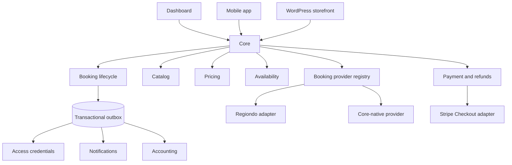

# Core booking architecture

## Scope and migration strategy

Core remains one deployable Fastify/PostgreSQL application. This change adds provider-independent domain records beside the existing Regiondo columns and routes; it does not rewrite booking IDs, remove legacy tables, or require a coordinated frontend release.

Offerings migrate independently through `location_products.booking_provider` (`regiondo` or `core`). `products.booking_provider` remains a catalog compatibility default, but new routing always resolves the venue-specific offering. Existing offerings are backfilled from their Product; Bookings carry their own immutable provider marker and selected `product_offering_id`. Legacy `regiondo_*` columns and `booking_products` remain compatibility projections while new code writes normalized provider references and immutable booking items.

## Audit findings

- Regiondo API access is concentrated in `src/modules/regiondo`, but purchase creation still exists in the large dashboard booking repository. Cancellation now resolves through the booking-provider registry; the remaining purchase paths should be moved in a later, separately reviewable change.
- Regiondo IDs were domain keys on locations, products, variants, bookings, and client imports. `provider_references` now gives bookings, locations, products, and variants a generic external identity while legacy IDs remain populated.
- Imported bookings used `booking_products` and mutable product data for display/reconstruction. Regiondo imports and native booking creation now also write `booking_items` snapshots.
- Payment rows previously had only amount, method, and a provider reference. Provider, lifecycle status, currency, minor-unit amount, checkout/payment IDs, metadata, and idempotency are now explicit. `refunds` are separate records and support multiple partial refunds.
- Capacity was already correctly centered on `resources`, `product_resources`, and `consumptions`, including serializable rebuilds. Reservation holds extend that model through resource allocations instead of introducing a second capacity system.
- Regiondo webhooks already had an idempotent retryable inbox. They now dual-write the generalized `integration_events` inbox while the old table remains the active compatibility worker.

## Provider abstraction

`bookingProviderRegistry` is the single resolver. Its interface covers normalized availability and booking creation in addition to booking retrieval, cancellation, change requests, provider-managed fields, and external admin URLs. The Regiondo implementation owns Regiondo payload/API mapping. Domain and client DTOs contain Core identifiers and normalized values.

The registry maps legacy non-Regiondo sources to `core`, preserving the old `getBookingProvider(source)` facade used by dashboard code.

## Native bookings and snapshots

Native creation requires a live reservation hold and an idempotency key. In one serializable transaction Core:

1. verifies the product is Core-managed;
2. verifies the hold matches client, product, location, quantity, and schedule;
3. recomputes the authoritative server-side quote;
4. creates a `payment_pending` booking;
5. stores booking item and option snapshots in integer minor units;
6. maintains `booking_products` as a legacy projection;
7. links the hold to the booking; and
8. appends `booking.created` to the transactional outbox.

Checkout creation reads the stored booking total and currency, reserves one idempotent Stripe payment row, and creates a hosted Stripe Checkout Session. No amount supplied by a client is accepted. Until a verified provider event confirms payment, the hold remains the capacity lease and the booking remains `payment_pending`.

## Booking and payment lifecycle

Valid native booking transitions are centralized in `booking-lifecycle.service.ts`. Legacy statuses are normalized at the boundary (`pending`/`processing` to `payment_pending`, `canceled`/`rejected` to `cancelled`) rather than rewritten in place.

Payment status is stored on payment rows and is projected independently in the client API. Supported states are `requires_payment`, `processing`, `succeeded`, `failed`, `cancelled`, `partially_refunded`, `refunded`, and `disputed`.

Stripe events are verified against the exact raw request body, deduplicated in `integration_events`, and processed by a retryable inbox worker. A paid Checkout Session or successful PaymentIntent executes one serializable transaction which validates amount/currency against Core, locks the booking/payment/hold/resources, creates authoritative `consumptions`, consumes the hold, records the successful payment, confirms the booking, and appends outbox events. Browser redirects never confirm bookings.

If payment completes after the hold lease elapsed, Core rechecks all live consumptions and other holds while resource rows are locked. It confirms when capacity remains. If capacity has been taken, Core retains the successful payment, moves the booking to `change_requested`, emits `provider.sync_conflict`, and requires operator resolution rather than overbooking or losing the payment fact.

## Pricing

`pricingService.quote` reads product, variant, option, discount, currency, and VAT configuration from PostgreSQL. Request bodies select products/options and quantity but never supply authoritative amounts. Calculations use integer minor units and VAT basis points. Confirmed/pending native bookings and synchronized Regiondo bookings persist net, tax, gross, VAT, names, option values, and price deltas as immutable snapshots.

`products.base_amount`, `product_variants.price`, `bookings.total_amount`, and `payments.amount` remain as decimal compatibility fields. New financial logic uses the corresponding `*_minor` columns.

## Catalog ownership and authoring

The catalog hierarchy remains `Product -> Product Variant -> Product Option`. Core-native authoring uses the existing `product_variants` and `product_options` tables; no parallel catalog or shared-option abstraction was introduced. A Variant owns its Options, and all prices/deltas are written in integer minor units with the Product currency.

Catalog ownership is explicit:

- a Product with `booking_provider = 'core'` exposes only Variant and Option rows whose legacy `regiondo_*` identifiers are null, and those rows are editable through the admin CRUD routes;
- a Product with `booking_provider = 'regiondo'` exposes provider-identified rows to active customer pricing/catalog queries, and Core mutation routes reject local edits;
- Dashboard permissions use `products:view` for display, `products:manage` for Variant/Option mutations and migration preparation, and `regiondo:manage` for provider sync.

A Core Product may have one implicit/default Variant. It is represented by a Core-owned Variant with `title IS NULL`; a partial unique index permits at most one per Product. The customer Product API remains backwards-compatible and returns that Variant with `title: null`, allowing clients to suppress a meaningless selector when it is the only Variant.

Variant deletion remains hard-delete only when foreign keys permit it. `booking_items.product_variant_id` and reservation-hold references use `ON DELETE RESTRICT`, so referenced Variants produce a clear conflict rather than cascading historical data. Option deletion is safe because `booking_item_options.product_option_id` uses `ON DELETE SET NULL`; option name, selected value, price delta, and currency remain in immutable snapshot columns.

Admin catalog routes are:

- `POST|PATCH|DELETE /api/admin/products/:productId/variants[/:variantId]`
- `POST|PATCH|DELETE /api/admin/products/:productId/variants/:variantId/options[/:optionId]`
- `POST /api/admin/products/:productId/core-migration/prepare`

Every nested mutation verifies Product/Variant/Option parent ownership. Calling these mutation routes for active Regiondo catalog data returns `PROVIDER_MANAGED_CATALOG`.

### Regiondo to Core preparation

Preparation is a prepare-once, idempotent snapshot. In one transaction it copies active Regiondo Variants and Options to rows on the same canonical Product with null `regiondo_*` identifiers. The Product remains `booking_provider = 'regiondo'`. Active customer catalog and pricing queries filter by the Product provider, so prepared Core rows cannot affect Regiondo commerce. Regiondo sync deletes/replaces only provider-identified rows and therefore cannot overwrite the prepared snapshot. Variant provider-reference metadata records the prepared Core Variant UUID; Option lineage is retained in the copied row's migration metadata because the current provider-reference enum does not include `product_option`.

Switching Regiondo to Core is a separate Product update. Core validates that a prepared native Variant catalog exists, catalog currency/pricing is valid, and enabled Location and Resource mappings exist. Regiondo sync preserves an already-switched Product's Core-owned title, description, image, price, and provider while continuing to refresh the inactive provider shadow rows.

## Availability and reservation holds

`getAvailability` is the authoritative capacity query. It combines overlapping `consumptions` with active, non-expired `reservation_hold_allocations`, and excludes resources marked `out_of_service`. The summary reports consumed/reserved capacity separately from temporary held capacity.

Hold creation uses a serializable transaction, locks all required resource rows in stable order, repeats the capacity check, and retries serialization failures. A product may require several resources; one hold header therefore owns multiple resource allocations. Idempotency keys prevent duplicate holds. The minute-level cleanup job changes elapsed active holds to `expired`; availability also checks `expires_at` directly, so delayed cleanup cannot reduce capacity incorrectly.

## Normalized offering configuration and quote

Each offering owns its provider, timezone, participant limits, advance rules, duration constraints, and one of `date_range`, `start_end`, `start_duration`, or `fixed_duration`. Variants may supply a real commercial duration override. App, WordPress, and Dashboard send the same canonical intent with `locationProductId`, `startAt`, `endAt`, participants, Variant, and Options.

`BookingQuoteService` validates the offering pairing and rules, dispatches availability to the selected provider, and applies Core pricing. It returns one envelope containing the normalized configuration, availability, integer-minor-unit pricing, a quote identifier, and expiry. Provider details and raw Regiondo payloads are not exposed.

## Cancellation and refunds

Cancellation policies store a deliberately small JSON array of time thresholds and refund basis points. The cancellation service produces a normalized quote. A cancellation that needs a provider refund moves to `cancel_requested`; Core does not mark it cancelled before the refund orchestration exists. A cancellation requiring no refund can complete locally, releasing consumptions/holds and revoking access credentials.

Refund rows are first-class, idempotent records. The service locks the payment and prevents pending/processing/succeeded refunds from exceeding the original payment total. Successful refunds update the independent payment lifecycle and emit `refund.completed`.

## Events, access, and notifications

`outbox_events` is a lightweight PostgreSQL transactional outbox. Domain transactions append events such as `booking.created`, booking state changes, `payment.succeeded`, and `refund.completed`. A retryable `FOR UPDATE SKIP LOCKED` dispatcher handles events after commit. `booking.confirmed` creates an idempotent QR access credential and in-app confirmation notification; `booking.cancelled` revokes credentials. Events without a local handler are acknowledged as published so future external publishers can be added behind the same dispatcher boundary. Existing access, notification, reminder, and audit tables remain authoritative.

## API additions

Authenticated customer routes were added without removing established routes:

- `GET /api/client/products` and `GET /api/client/products/:productId`
- `GET /api/client/products/:productId/availability`
- `POST /api/client/booking-quotes`
- `POST|DELETE /api/client/reservation-holds[/:holdId]`
- `POST /api/client/bookings`
- `POST /api/client/bookings/:bookingId/checkout`
- `GET /api/client/bookings/:bookingId/cancellation-quote`
- `POST /api/client/bookings/:bookingId/cancel`

Stripe sends signed events to `POST /webhooks/stripe`. The endpoint durably accepts valid events with `202`, while the inbox worker performs domain changes asynchronously.

Mutating booking, hold, and checkout creation calls require `x-idempotency-key`.

Equivalent normalized routes are available at `POST /api/web/booking-quotes`, `POST /api/web/booking-holds`, `POST /api/admin/booking-quotes`, `POST /api/admin/booking-holds`, and `POST /api/admin/bookings`. Admin rule/availability/no-payment overrides are explicit and require `bookings:manage`.

## Deferred work

- Final cancellation/refund orchestration after the payment provider is selected.
- External accounting/analytics outbox publishers and reminder scheduling from booking events.
- Moving the legacy task-driven Regiondo purchase flow (which has task-specific payload semantics) onto the normalized intent adapter.
- Promotion usage redemption/locking and multi-item/multi-tax discount allocation beyond the current single-product quote endpoint.
- Database-backed concurrency tests against a disposable PostgreSQL instance and production migration rehearsal.
- Product publish/draft lifecycle; no existing active/published column was available, so incomplete Product visibility remains a focused follow-up.
- Location-specific Variant restrictions and shared Product Options. Current Variants remain available at every enabled Product Offering and Options remain Variant-owned.
- Refreshing an already-prepared migration snapshot. The implemented policy intentionally keeps the first Core copy independent for review.

