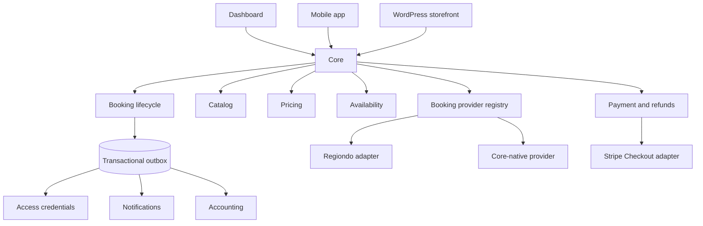

# Core booking architecture

## Scope and migration strategy

Core remains one deployable Fastify/PostgreSQL application. This change adds provider-independent domain records beside the existing Regiondo columns and routes; it does not rewrite booking IDs, remove legacy tables, or require a coordinated frontend release.

Products migrate independently through `products.booking_provider` (`regiondo` or `core`). Existing rows with a Regiondo product ID are backfilled to `regiondo`; other and newly created products default to `core`. Bookings carry the same explicit provider marker. Legacy `regiondo_*` columns and `booking_products` remain compatibility projections while new code writes normalized provider references and immutable booking items.

## Audit findings

- Regiondo API access is concentrated in `src/modules/regiondo`, but purchase creation still exists in the large dashboard booking repository. Cancellation now resolves through the booking-provider registry; the remaining purchase paths should be moved in a later, separately reviewable change.
- Regiondo IDs were domain keys on locations, products, variants, bookings, and client imports. `provider_references` now gives bookings, locations, products, and variants a generic external identity while legacy IDs remain populated.
- Imported bookings used `booking_products` and mutable product data for display/reconstruction. Regiondo imports and native booking creation now also write `booking_items` snapshots.
- Payment rows previously had only amount, method, and a provider reference. Provider, lifecycle status, currency, minor-unit amount, checkout/payment IDs, metadata, and idempotency are now explicit. `refunds` are separate records and support multiple partial refunds.
- Capacity was already correctly centered on `resources`, `product_resources`, and `consumptions`, including serializable rebuilds. Reservation holds extend that model through resource allocations instead of introducing a second capacity system.
- Regiondo webhooks already had an idempotent retryable inbox. They now dual-write the generalized `integration_events` inbox while the old table remains the active compatibility worker.

## Provider abstraction

`bookingProviderRegistry` is the single resolver. Its focused interface exposes only operations Core currently delegates: provider availability, booking retrieval, cancellation, change requests, provider-managed fields, and external admin URLs. The Regiondo implementation owns Regiondo payload/API mapping. Domain and client DTOs contain Core identifiers and normalized values.

The registry maps legacy non-Regiondo sources to `core`, preserving the old `getBookingProvider(source)` facade used by dashboard code.

## Native bookings and snapshots

Native creation requires a live reservation hold and an idempotency key. In one serializable transaction Core:

1. verifies the product is Core-managed;
2. verifies the hold matches client, product, location, quantity, and schedule;
3. recomputes the authoritative server-side quote;
4. creates a `payment_pending` booking;
5. stores booking item and option snapshots in integer minor units;
6. maintains `booking_products` as a legacy projection;
7. links the hold to the booking; and
8. appends `booking.created` to the transactional outbox.

Checkout creation reads the stored booking total and currency, reserves one idempotent Stripe payment row, and creates a hosted Stripe Checkout Session. No amount supplied by a client is accepted. Until a verified provider event confirms payment, the hold remains the capacity lease and the booking remains `payment_pending`.

## Booking and payment lifecycle

Valid native booking transitions are centralized in `booking-lifecycle.service.ts`. Legacy statuses are normalized at the boundary (`pending`/`processing` to `payment_pending`, `canceled`/`rejected` to `cancelled`) rather than rewritten in place.

Payment status is stored on payment rows and is projected independently in the client API. Supported states are `requires_payment`, `processing`, `succeeded`, `failed`, `cancelled`, `partially_refunded`, `refunded`, and `disputed`.

Stripe events are verified against the exact raw request body, deduplicated in `integration_events`, and processed by a retryable inbox worker. A paid Checkout Session or successful PaymentIntent executes one serializable transaction which validates amount/currency against Core, locks the booking/payment/hold/resources, creates authoritative `consumptions`, consumes the hold, records the successful payment, confirms the booking, and appends outbox events. Browser redirects never confirm bookings.

If payment completes after the hold lease elapsed, Core rechecks all live consumptions and other holds while resource rows are locked. It confirms when capacity remains. If capacity has been taken, Core retains the successful payment, moves the booking to `change_requested`, emits `provider.sync_conflict`, and requires operator resolution rather than overbooking or losing the payment fact.

## Pricing

`pricingService.quote` reads product, variant, option, discount, currency, and VAT configuration from PostgreSQL. Request bodies select products/options and quantity but never supply authoritative amounts. Calculations use integer minor units and VAT basis points. Confirmed/pending native bookings and synchronized Regiondo bookings persist net, tax, gross, VAT, names, option values, and price deltas as immutable snapshots.

`products.base_amount`, `product_variants.price`, `bookings.total_amount`, and `payments.amount` remain as decimal compatibility fields. New financial logic uses the corresponding `*_minor` columns.

## Availability and reservation holds

`getAvailability` is the authoritative capacity query. It combines overlapping `consumptions` with active, non-expired `reservation_hold_allocations`, and excludes resources marked `out_of_service`. The summary reports consumed/reserved capacity separately from temporary held capacity.

Hold creation uses a serializable transaction, locks all required resource rows in stable order, repeats the capacity check, and retries serialization failures. A product may require several resources; one hold header therefore owns multiple resource allocations. Idempotency keys prevent duplicate holds. The minute-level cleanup job changes elapsed active holds to `expired`; availability also checks `expires_at` directly, so delayed cleanup cannot reduce capacity incorrectly.

## Cancellation and refunds

Cancellation policies store a deliberately small JSON array of time thresholds and refund basis points. The cancellation service produces a normalized quote. A cancellation that needs a provider refund moves to `cancel_requested`; Core does not mark it cancelled before the refund orchestration exists. A cancellation requiring no refund can complete locally, releasing consumptions/holds and revoking access credentials.

Refund rows are first-class, idempotent records. The service locks the payment and prevents pending/processing/succeeded refunds from exceeding the original payment total. Successful refunds update the independent payment lifecycle and emit `refund.completed`.

## Events, access, and notifications

`outbox_events` is a lightweight PostgreSQL transactional outbox. Domain transactions append events such as `booking.created`, booking state changes, `payment.succeeded`, and `refund.completed`. A retryable `FOR UPDATE SKIP LOCKED` dispatcher handles events after commit. `booking.confirmed` creates an idempotent QR access credential and in-app confirmation notification; `booking.cancelled` revokes credentials. Events without a local handler are acknowledged as published so future external publishers can be added behind the same dispatcher boundary. Existing access, notification, reminder, and audit tables remain authoritative.

## API additions

Authenticated customer routes were added without removing established routes:

- `GET /api/client/products` and `GET /api/client/products/:productId`
- `GET /api/client/products/:productId/availability`
- `POST /api/client/booking-quotes`
- `POST|DELETE /api/client/reservation-holds[/:holdId]`
- `POST /api/client/bookings`
- `POST /api/client/bookings/:bookingId/checkout`
- `GET /api/client/bookings/:bookingId/cancellation-quote`
- `POST /api/client/bookings/:bookingId/cancel`

Stripe sends signed events to `POST /webhooks/stripe`. The endpoint durably accepts valid events with `202`, while the inbox worker performs domain changes asynchronously.

Mutating booking, hold, and checkout creation calls require `x-idempotency-key`.

## Deferred work

- Final cancellation/refund orchestration after the payment provider is selected.
- External accounting/analytics outbox publishers and reminder scheduling from booking events.
- Moving the two remaining dashboard Regiondo purchase flows behind a normalized provider `createBooking` contract.
- WordPress storefront work; WordPress should consume these Core APIs and must not become canonical storage.
- Promotion usage redemption/locking and multi-item/multi-tax discount allocation beyond the current single-product quote endpoint.
- Database-backed concurrency tests against a disposable PostgreSQL instance and production migration rehearsal.

