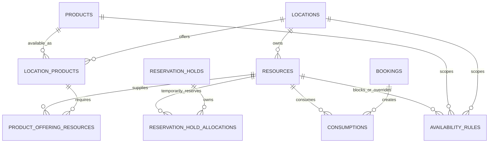

# Resources, Product Offerings, and availability

## Audited state

PostgreSQL is authoritative; this repository does not use Drizzle. The schema is maintained by ordered additive SQL files in `db/migrations`.

Before migration 527, Resources were already owned by a non-null `location_id`, Product Offerings already had stable UUIDs in `location_products.product_offering_id`, and the Dashboard already had read-only Resource list/detail pages. Resource creation/update/deactivation, Offering Resource requirements, and Availability Rule authoring were absent. Availability, hold allocation, and consumption rebuilds resolved requirements exclusively from legacy `product_resources`.

`availability_rules` already supported Location, Product, Variant, and Resource references, recurring/date-range/manual-block rule types, local recurring times, absolute ranges, time zones, and optional capacity overrides. The web booking API already used recurring/date-range Product rules as bookable windows. Manual blocks are now excluded from slot generation and applied by the capacity engine.

## Final model



`location_products` remains the physical Product Offering table. `product_offering_resources` has one row per Offering and Resource, with `quantity` meaning capacity required per booking unit. Core rejects a requirement unless the Resource and Offering have the same Location.

## Requirement resolution and migration

For an enabled Offering, Core resolves capacity requirements as follows:

1. If any `product_offering_resources` rows exist, use only those rows.
2. Otherwise, read matching-location rows from legacy `product_resources`.
3. Never combine both sources, so capacity cannot be double counted.

Migration 527 copies only legacy mappings whose Resource Location exactly matches a Product Offering Location. It is idempotent and leaves `product_resources` unchanged. Mappings without a matching Offering are recorded in `product_offering_resource_migration_conflicts` for manual review; no Location is guessed. New Dashboard writes target only Offering Resources.

## Capacity calculation

For every required Resource:

```text
effective capacity
- overlapping confirmed/reserved/blocked/maintenance Consumptions
- overlapping active, non-expired hold allocations
= remaining capacity
```

The required amount is `requirement quantity × booking quantity`. All required Resources must have enough remaining capacity. An overlapping active `manual_block` Availability Rule changes effective capacity to its `capacity_override`; a null override means zero. The most restrictive overlapping block wins.

Recurring and date-range rules are positive windows. A scope with no positive rules stays open for backwards compatibility. Once Location rules exist, a request must fit a Location window; once Product + Location rules exist, it must also fit an Offering window. Availability diagnostics and reservation-hold creation both enforce these windows. Current recurring-window authoring is same-day; overnight windows should be represented as two rules until overnight recurrence is added explicitly.

Reservation Holds and Consumptions remain runtime-managed. Staff cannot create them through normal CRUD. Hold creation stays serializable, locks Resource rows in stable order, and rechecks capacity. Payment confirmation continues to create Consumptions from the hold allocations. Consumption rebuild now uses the same Offering-first requirement resolver.

## Ownership and lifecycle

- Staff/provider-managed: Locations, Products, Variants, Options, Product Offerings, Resources, Offering Resource requirements, Availability Rules.
- Runtime-managed: Reservation Holds, Reservation Hold Allocations, Consumptions.
- Calculated: Availability, remaining capacity, maximum bookable quantity.

Resource `DELETE` is intentionally a safe deactivation: it sets `operational_status = 'out_of_service'`. It does not delete historical Consumptions, holds, rules, or Offering mappings. A Resource with Product or Offering mappings cannot be moved to another Location.

## Admin APIs

- `GET|POST /api/admin/resources`
- `GET|PATCH|DELETE /api/admin/resources/:resourceId`
- `GET|POST /api/admin/product-offerings/:offeringId/resources`
- `PATCH|DELETE /api/admin/product-offerings/:offeringId/resources/:resourceId`
- `GET /api/admin/product-offering-resource-migration-conflicts`
- `GET|POST /api/admin/availability-rules`
- `PATCH|DELETE /api/admin/availability-rules/:ruleId`
- `GET /api/admin/availability` and `GET /api/admin/products/:productId/availability` remain the diagnostic calculation APIs.

The existing `resources:view` and `resources:manage` permissions protect Resource and rule APIs. Offering Resource mutations use `products:manage`. All staff mutations write to the existing admin audit log.

## Deliberately deferred

Variant-specific and Option-specific Resource requirements remain out of scope. Regiondo availability remains provider-owned. Recurring and date-range rules continue to define Product bookable windows in the web availability service; the Dashboard currently provides structured manual Resource capacity blocks first.
